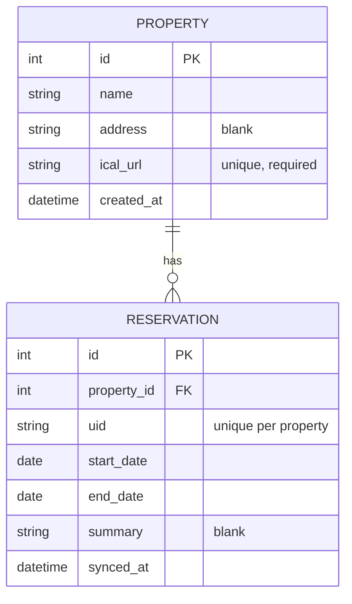

# Data model

## Property + Reservation

Each `Property` has its own distinct booking.com iCal export link
(1-to-1: one iCal URL per property). `Reservation` rows are imported from
that feed — one row per iCal `VEVENT`, matched on `uid` so re-syncing
updates existing rows instead of duplicating them.

